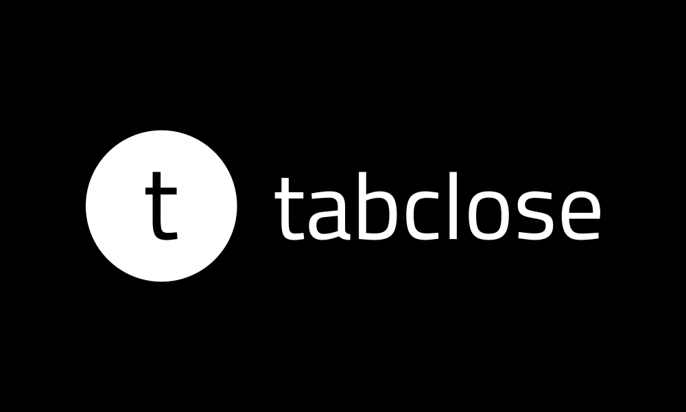

# TabClose

<p align="center">
  
</p>

<p align="center">
  <strong>Automatic tab management for a cleaner browser</strong>
</p>

---

## Overview

TabClose is a Chrome extension that automatically closes inactive tabs to keep your browser clean and fast. Choose between continuous monitoring with an inactivity timer or scheduled daily cleanups.

## Features

- ⏱️ **Inactivity Timer** - Automatically close tabs after a set period (default: 6 hours)
- 📅 **Scheduled Cleanup** - Close all inactive tabs once daily at a specific time
- 🛡️ **Smart Protection** - Never closes pinned tabs, active tabs, or tabs playing audio
- 🔒 **Domain Exclusions** - Protect important sites like Gmail, Calendar, etc.
- 🎚️ **Global Toggle** - Turn on/off with a single click
- ✨ **Clean Interface** - View and edit modes for a streamlined experience

## Installation

### 📦 Quick Install (5 Easy Steps!)

**No Chrome Web Store needed - install directly from GitHub!**

#### 1️⃣ Download the Extension
- Go to the [**Releases page**](../../releases)
- Click on the latest release
- Download the `tabclose.zip` file
- **Unzip it** to a folder on your computer (remember this location!)

#### 2️⃣ Open Chrome Extensions
- Open Chrome browser
- Type `chrome://extensions/` in your address bar and press Enter
- Or: Menu (⋮) → Extensions → Manage Extensions

#### 3️⃣ Enable Developer Mode
- Look for the toggle switch in the **top-right corner**
- Turn on **"Developer mode"**

#### 4️⃣ Load the Extension
- Click the **"Load unpacked"** button (appears after enabling developer mode)
- Navigate to and select the **unzipped `tabclose` folder**
- Click **"Select Folder"**

#### 5️⃣ Start Using TabClose! 🎉
- The TabClose icon should appear in your Chrome toolbar
- Click it to configure your settings
- You're all set!

---

### 🎥 Visual Guide

**Don't see the extension icon in your toolbar?**
Click the puzzle piece icon (🧩) in Chrome's toolbar, then pin TabClose for easy access.

---

### 🛠️ Install from Source (For Developers)

```bash
# Clone the repository
git clone https://github.com/yourusername/tabclose.git
cd tabclose

# Then follow steps 2-5 above using the cloned folder
```

---

### ❓ Troubleshooting

<details>
<summary><b>Extension doesn't appear after loading?</b></summary>

- Make sure you selected the correct folder (the one containing `manifest.json`)
- Check that all files are present in the folder
- Try restarting Chrome
</details>

<details>
<summary><b>"Manifest file is missing or unreadable" error?</b></summary>

- Make sure you **extracted/unzipped** the ZIP file completely
- Don't select the ZIP file itself - select the extracted folder
- The folder should contain `manifest.json`, `background.js`, etc.
</details>

<details>
<summary><b>Extension keeps getting disabled?</b></summary>

- This is normal for developer mode extensions
- Chrome may show a warning banner - this is safe to ignore
- Just re-enable it when Chrome asks
- Your settings will be preserved
</details>

<details>
<summary><b>How do I update to a new version?</b></summary>

**Option 1: Refresh (Recommended)**
1. Download the new version ZIP
2. Extract and replace the old folder
3. Go to `chrome://extensions/`
4. Click the refresh icon (🔄) on the TabClose card

**Option 2: Reinstall**
1. Remove the old extension
2. Follow installation steps 1-5 with the new version
</details>

<details>
<summary><b>Can I install this on other browsers?</b></summary>

- **Microsoft Edge**: Yes! Follow the same steps (Edge uses the same extension system)
- **Brave**: Yes! Same steps as Chrome
- **Opera**: Yes! Same steps as Chrome
- **Firefox**: Not currently supported (uses different extension format)
</details>

## Usage

### Getting Started
1. Click the TabClose icon in your Chrome toolbar
2. Toggle TabClose ON (it's on by default)
3. Choose your preferred mode:
   - **Inactivity Timer** - Tabs close after X minutes of inactivity
   - **Scheduled** - All inactive tabs close once daily at a set time

### Adding Domain Exclusions
1. Click "Edit Settings"
2. Scroll to "Excluded Domains"
3. Enter a domain (e.g., `gmail.com` or `https://www.youtube.com`)
4. Click "Add"
5. Click "Save Settings"

### View Mode
The default view shows your current settings at a glance:
- Current mode (Inactivity Timer or Scheduled)
- Time setting
- Number of excluded domains

Click "Edit Settings" to make changes.

### Edit Mode
In edit mode, you can:
- Switch between Inactivity Timer and Scheduled modes
- Adjust time settings
- Add/remove excluded domains
- Save changes or Cancel to revert

## How It Works

TabClose tracks the last time you interacted with each tab. Depending on your settings:

- **Inactivity Timer Mode**: Checks every minute and closes tabs that haven't been active for your specified duration
- **Scheduled Mode**: Runs once per day at your chosen time and closes all tabs that have been inactive for at least 1 minute

### Protected Tabs
The following tabs are never closed:
- Pinned tabs
- Your currently active tab
- Tabs playing audio
- Tabs from excluded domains

## Privacy

TabClose respects your privacy:
- ✅ All data stored locally on your device
- ✅ No external servers or data collection
- ✅ No tracking or analytics
- ✅ Open source and transparent

## Development

### Project Structure
```
tabclose/
├── background.js       # Service worker for tab monitoring
├── popup.html         # Extension popup interface
├── popup.js           # Popup logic and interactions
├── style.css          # Popup styling
├── welcome.html       # About/info page
├── manifest.json      # Extension manifest
└── favicon_io/        # Icons and logos
```

### Building for Production
1. Update version in `manifest.json`
2. Update author name in `manifest.json`
3. Test all features thoroughly
4. Create a ZIP file with only necessary files:
   ```bash
   zip -r tabclose.zip . -x "*.git*" "*.DS_Store" "*.md" "*node_modules*"
   ```

## Contributing

Contributions are welcome! Please feel free to submit a Pull Request.

## License

MIT License - feel free to use this project for learning or building your own extensions.

## Support

If you encounter any issues or have suggestions:
1. Check existing [GitHub Issues](#)
2. Create a new issue with details
3. Or contact the developer

## Changelog

### v1.0.0 (Initial Release)
- Inactivity timer mode
- Scheduled cleanup mode
- Domain exclusion management
- Global on/off toggle
- View/Edit mode interface
- Smart tab protection
- Comprehensive error handling

---

Made with ❤️ for a cleaner browsing experience
